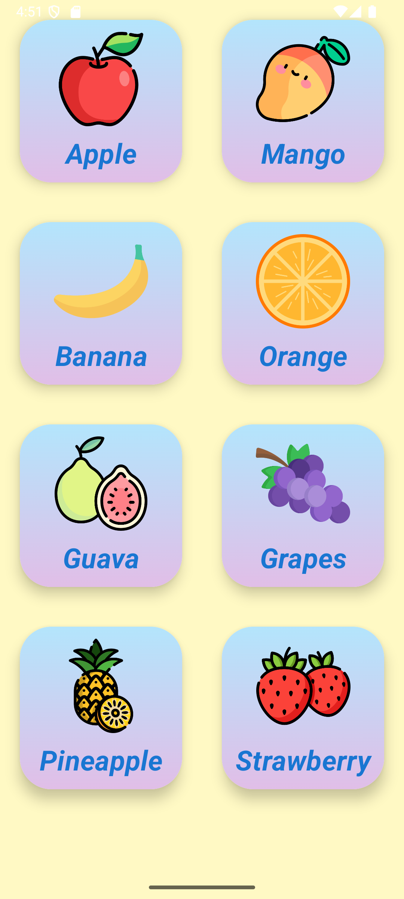

# Fruit, Vegetable, and Animal List App

This Android app displays three icons on the main screen: Fruit, Vegetable, and Animal. When an icon is clicked, it opens a list of items in that category. Clicking on an item in the list will speak the name of the item using Text-to-Speech.

## Features

- Displays three icons on the main screen: Fruit, Vegetable, and Animal.
- Opens a list of items when an icon is clicked.
- Speaks the name of the item when clicked.

## Screenshots





## Installation

1. Clone the repository:
    ```sh
    git clone https://github.com/Amrish-Sharma/fruit-vegetable-animal-list-app.git
    ```
2. Open the project in Android Studio.
3. Build and run the app on an Android device or emulator.

## Usage

1. Launch the app.
2. Click on one of the icons (Fruit, Vegetable, or Animal) on the main screen.
3. A list of items will be displayed.
4. Click on an item in the list to hear its name spoken aloud.

## Code Structure

- `MainActivity.java`: Handles the main screen with three icons.
- `FruitActivity.java`, `VegetableActivity.java`, `AnimalActivity.java`: Handle the respective lists and Text-to-Speech functionality.
- `activity_main.xml`: Layout for the main screen.
- `activity_list.xml`: Layout for the list screens.
- `list_row_items.xml`: Layout for individual list items.

## Dependencies

- Android SDK
- Text-to-Speech

## License

This project is licensed under the MIT License. See the `LICENSE` file for details.